# MORE Limesurvey
MORE-Specific Repackaging of Limesurvey

---
## Development

This repository contains a `docker-compose.yaml` to launch Limesurvey locally for development and testing.

Before starting the services, copy the example environment file and adjust the values if needed:

```bash
cp .env.example .env
```

After starting the Compose using `docker compose up -d`, Limesurvey is available at http://localhost:8080.
To access the configuration backend, login via http://localhost:8080/index.php/admin/authentication/sa/login.

---

## Authentication 

For authentication in MORE we use SSO based on OAuth with Keycloak.
With the plugin https://github.com/SondagesPro/limesurvey-oauth2, we can use our account we use for the
MORE Study-Manager to sign in to Limesurvey.

The OAuth-plugin is shipped within this docker-image, but needs to be "loaded" before it can be
enabled and configured.
Go to `Configuration > Settings > Plugins`, press the `Scan files`-Button and select the
`AuthOAuth2`-Plugin.

Then continue with the configuration of the plugin:

- Client ID: `limesurvey`
- Client Secret can be found in the limesurvey client on Keycloak
- Authorize URL: https://auth.more.redlink.io/realms/Auth-Client-Test/protocol/openid-connect/auth
- Scopes: `openid`
- Access Token URL: https://auth.more.redlink.io/realms/Auth-Client-Test/protocol/openid-connect/token
- User Details URL: https://auth.more.redlink.io/realms/Auth-Client-Test/protocol/openid-connect/userinfo
- Key for username in user details: `preferred_username`
- Key for e-mail in user details: `email`
- Key for display name in user details: `name`
- Check "Create new users", which creates a new user after successfull login

You can set global roles for new users. Roles can be created as administrator under
`Configuration > Users > User roles > Add user role`. Once a new role is created,
it can be added as a global role for new users.

Finally, enable the plugin in the Overview.

**NOTE**: Even if you enable OAuth2 as the _default login_ mechanism, you can always switch to the default
(local database) login by directly going to `${BASE_URL}/index.php/admin/authentication/sa/login/authMethod/Authdb`. 

---

## Limesurvey API (Remote Control)

### Global Settings
 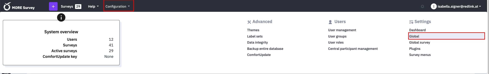

#### JSON-RPC
Limesurvey uses JSON-RPC. This has to be enabled first before it can be used in
`Configuration > Settings > Global > Interfaces` as such:

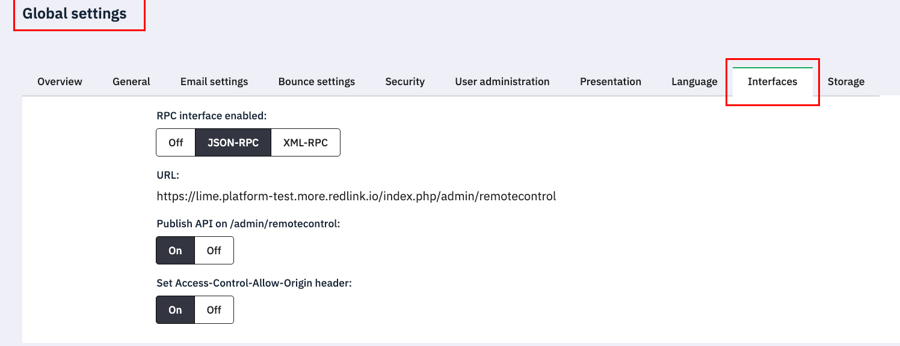

To use the API, you first need to get a session key. Only then you can use it. The most important
requests for us are:

- get_session_key
- add_survey (creates a new survey)
- activate_tokens (creates a participant table, which is needed to import participants)
- add_participants (creates participants with defined parameters, such as token or uses left)
- activate_survey
- copy_survey
- list_surveys (lists all surveys belonging to a user)
- delete_survey

### Global Survey Settings
 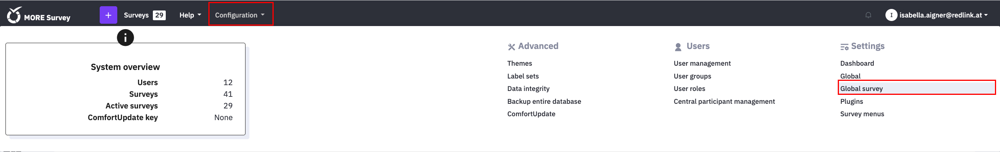

We must modify the default settings in Limesurvey and ensure that these feature are activated within the Global Survey Settings:

#### Presentation
under the Presentation section turn on Automatically load end URL when survey complete:

`Configuration > Settings > Global survey > Presentation`

  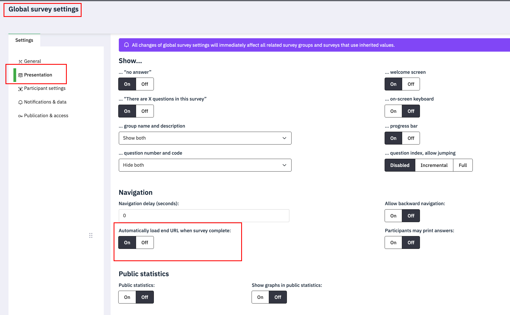

#### Participant settings
under the Participant settings trun on Allow multiple responses or update responses with one access code:

`Configuration > Settings > Global survey > Participant settings`

  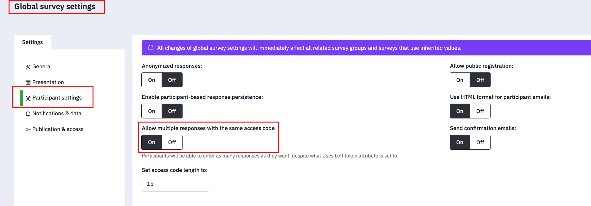

#### Notifications & Data
under the "Notifications & Data" section you must enable "Date stamp" to store the date-timestamp

`Configuration > Settings > Global survey > Notifications & Data`

  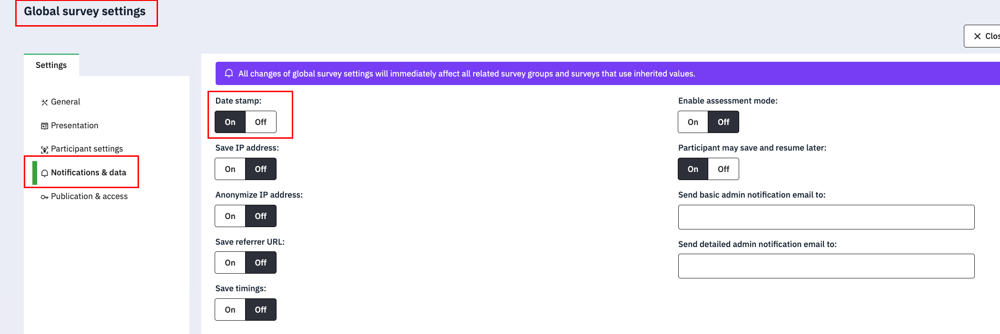

---

## Build-in Auditlog Plugin

The built-in Audit Log plugin provided by Limesurvey logs actions performed within the admin interface. This makes it a solid foundation for tracking and analyzing activities on the admin panel side. The recorded data can be accessed via the terminal for further inspection and analysis.

 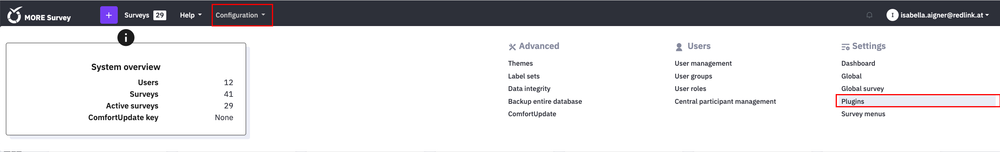

### Activate the Auditlog Plugin
  `Configuration > Plugins > Auditlog (activate via button)`

 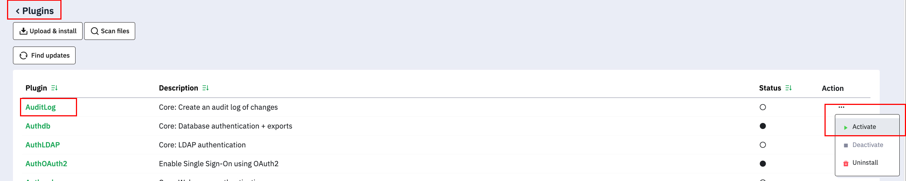

### Access the Auditlog

Once activated, the buildin AuditLog will track any action on the admin interface. You can access the data via the terminal as follows:

#### Table Information - Get the basic table information

```bash
docker exec -it [Lime DB Docker Container] psql -U limesurvey -d limesurvey -c "\dt lime_audit*"
```

_Example Output:_

| Schema | Name               | Type  | Owner      |
|--------|--------------------|-------|------------|
| public | lime_auditlog_log | table | limesurvey |


#### Table Information - Get the table fields

```bash
docker exec -it [Lime DB Docker Container] psql -U limesurvey -d limesurvey -c "\d lime_auditlog_log"
```

_Example:_

| Column     | Type         | Nullable | Description                                      |
|------------|--------------|----------|--------------------------------------------------|
| id         | integer      | NOT NULL | Primary key, auto-increment                      |
| created    | timestamp    | -        | When the action occurred                         |
| uid        | varchar(255) | -        | Limesurvey user ID who performed the action      |
| entity     | varchar(255) | -        | What was affected (e.g. token, survey)           |
| entityid   | varchar(255) | -        | ID of the affected entity                        |
| action     | varchar(255) | -        | What happened (e.g. create, update, delete)      |
| fields     | text         | -        | Which fields were affected                       |
| oldvalues  | text         | -        | Values before the action                         |
| newvalues  | text         | -        | Values after the action                          |

 
#### Table data

```bash
# Get the last 20 entries
docker exec -it [Lime DB Docker Container] psql -U limesurvey -d limesurvey -c "SELECT * FROM lime_auditlog_log ORDER BY created DESC LIMIT 20;"
```

_Example: Creating a participant in the participant table:_

| Field              | Value                                                                                                                                                                           |
|--------------------|---------------------------------------------------------------------------------------------------------------------------------------------------------------------------------|
| ID                 | 1                                                                                                                                                                               |
| Created            | 2026-04-07 13:21:08                                                                                                                                                             |
| User ID (uid)      | 1 (admin)                                                                                                                                                                       |
| Entity             | token_376198                                                                                                                                                                    |
| Action             | create                                                                                                                                                                          |
| Fields             | sent, remindersent, remindercount, completed, usesleft, emailstatus, firstname, lastname, email, token, language, validfrom, validuntil, tid, participant_id, blacklisted, mpid |
| Old Values         | (empty)                                                                                                                                                                         |
| New Values         | firstname: Test, lastname: Patient, email: test@test.at, token: (empty), completed: N, usesleft: 1, sent: N, emailstatus: OK, language: en                                      |

---


## UserAuditLog Plugin

The **UserAuditLogPlugin** records a complete audit trail of participant interactions with LimeSurvey surveys. It logs page loads, answer changes, and survey submissions to the flat `lime_user_audit_log` table. This is intended for eCRF and GDPR compliance use cases and is compatible with LimeSurvey 6.x.

The plugin is separate from LimeSurvey's built-in **Auditlog** plugin. For complete eCRF/GDPR traceability, use all three sources together:

- the `.lss` survey structure export,
- the built-in `lime_auditlog_log` table,
- the `lime_user_audit_log` table created by this plugin.

The plugin should be installed in this docker image by default. It still needs to be added to LimeSurvey via the plugin manager scan and then activated globally before it can be enabled for individual surveys.

### Install and enable the UserAuditLog plugin

1. The `UserAuditLogPlugin` folder should be already included in the docker image at:

   ```text
   limesurvey/plugins/UserAuditLogPlugin
   ```

2. Add the plugin to LimeSurvey by scanning the installed plugin files:

   `Configuration > Settings > Plugins > Scan files`

3. Select the **UserAuditLogPlugin** from the scan results and add it.

4. Activate the plugin from the LimeSurvey admin interface:

   `Configuration > Plugins > UserAuditLogPlugin > Activate`

   Alternatively, activate it from the terminal:

   ```bash
   php application/commands/console.php plugin activate UserAuditLogPlugin
   ```

5. On first activation, the plugin automatically creates and migrates the `lime_user_audit_log` database table.

### Build the distributable ZIP

To build a ZIP file that can be uploaded through the LimeSurvey plugin manager, run:

```bash
bash scripts/build.sh
```

The resulting file is created at:

```text
dist/UserAuditLogPlugin.zip
```

### Enable audit logging for a specific survey

The plugin is opt-in per survey. Activating it globally does not start logging automatically.

For each survey that should be tracked:

1. Open the survey in the LimeSurvey admin interface.
2. Go to:

   `Survey settings > Plugins > UserAuditLogPlugin`

3. Set **Audit log for this survey** to **Activated**.
4. Save the plugin settings.

After this is enabled, the plugin writes participant interactions for that survey to `lime_user_audit_log`.

### Interact with the UserAuditLog plugin

#### Via the LimeSurvey admin UI

The plugin provides a survey-specific datatable view. To browse and filter audit entries without leaving LimeSurvey, go to:

```text
Survey > Plugin actions > UserAuditLogPlugin
```

#### Via the database

Read audit events from the `lime_user_audit_log` table. For example, to fetch all events for one survey:

```sql
SELECT * FROM lime_user_audit_log
WHERE survey_id = 123456
ORDER BY created_at ASC;
```

To fetch all events for one participant in one survey:

```sql
SELECT * FROM lime_user_audit_log
WHERE survey_id = 123456
  AND participant_token = 'abc123'
ORDER BY created_at ASC;
```

To fetch only answer changes:

```sql
SELECT * FROM lime_user_audit_log
WHERE survey_id = 123456
  AND event_type = 'answer_change'
ORDER BY created_at ASC;
```

To export a survey's audit log to CSV from the PostgreSQL CLI:

```bash
docker exec -it [Lime DB Docker Container] psql -U limesurvey -d limesurvey -c "COPY (SELECT * FROM lime_user_audit_log WHERE survey_id = 123456 ORDER BY created_at ASC) TO STDOUT WITH CSV HEADER" > audit_123456.csv
```

### Logged event types

The plugin records the following event types:

- `survey_open`
- `page_load`
- `answer_change`
- `survey_submit`

For `answer_change` events, the table stores field-level old and new values together with survey, participant, session, page, group, question, sub-question, column, ranking, and input type metadata.

Text fields are logged when the user leaves the field, not for every keystroke.

### Audit log table overview

The main table created by the plugin is `lime_user_audit_log`.

| Column              | Description                                                                   |
|---------------------|-------------------------------------------------------------------------------|
| `id`                | Row identity                                                                  |
| `created_at`        | Timestamp of the event                                                        |
| `survey_id`         | LimeSurvey survey ID                                                          |
| `participant_token` | Survey access token; resolves to the participant via `lime_tokens_{surveyId}` |
| `oauth_user_id`     | Authenticated user ID, or `NULL` for guests                                   |
| `oauth_username`    | Authenticated username, or `NULL` for guests                                  |
| `event_type`        | `survey_open`, `page_load`, `answer_change`, or `survey_submit`               |
| `page_number`       | Current page or step index                                                    |
| `group_id`          | LimeSurvey question group ID                                                  |
| `question_id`       | Numeric LimeSurvey question ID                                                |
| `sub_question_id`   | Numeric sub-question ID for matrix, array, or multi-field questions           |
| `column_id`         | Numeric column question ID for supported array question types                 |
| `rank_position`     | Ranking position for ranking questions                                        |
| `input_type`        | Readable input category, such as `text-question/short-text` or `array/array`  |
| `old_value`         | Value before the change                                                       |
| `new_value`         | Value after the change                                                        |
| `session_id`        | PHP session ID                                                                |
| `ip_address`        | IP address, including IPv6 support                                            |

### Question type representation

For `answer_change` events, LimeSurvey question types are normalized into readable `input_type` values. Examples include:

| LS Code | Description      | `input_type`                      |
|---------|------------------|-----------------------------------|
| `L`     | List radio       | `single-choice/list-radio`        |
| `!`     | List dropdown    | `single-choice/list-dropdown`     |
| `Y`     | Yes / No         | `mask-question/yes-no`            |
| `M`     | Multiple choice  | `multiple-choice/multiple-choice` |
| `S`     | Short text       | `text-question/short-text`        |
| `T`     | Long text        | `text-question/long-text`         |
| `D`     | Date / Time      | `mask-question/date-time`         |
| `N`     | Numerical        | `mask-question/numerical`         |
| `R`     | Ranking          | `mask-question/ranking`           |
| `A`     | Array five-point | `array/five-point-choice`         |
| `F`     | Generic array    | `array/array`                     |
| `:`     | Array numbers    | `array/numbers`                   |
| `;`     | Array text       | `array/text`                      |

Display-only question types such as boilerplate and computed equation questions are not logged as answer changes.

### Authentication and user identity

UserAuditLogPlugin does not enforce authentication by itself. It logs the authenticated user if one is present and stores `NULL` identity values for guest access.

For surveys that must only be completed by authenticated users, enable the **AuthSurvey** plugin for the same survey. When both plugins are active, audit log rows can include the authenticated user's `oauth_user_id` and `oauth_username`.

### Documentation

Additional plugin documentation is available in the plugin repository:

- `docs/AuditLogSpecification.md` — schema design decisions, storage approach, and event types
- `docs/AuditlogQuestionTypes.md` — how each LimeSurvey question type is represented in the audit log table
- `docs/UserGuide.md` — how to activate the plugin, enable logging per survey, and access the audit log

---

## AuthSurvey Plugin

The **AuthSurvey** plugin allows selected surveys to be displayed and submitted only by authenticated users. Each survey can have its own authentication policy, so the plugin can be enabled only for surveys that require access protection.

### Install and enable the AuthSurvey plugin

1. The `AuthSurvey` folder should be already included in the docker image at:

   ```text
   limesurvey/plugins/AuthSurvey
   ```

2. Add the plugin to LimeSurvey by scanning the installed plugin files:

   `Configuration > Settings > Plugins > Scan files`

3. Select the **AuthSurvey** plugin from the scan results and add it.

4. Activate the **AuthSurvey** plugin from the plugin overview.

   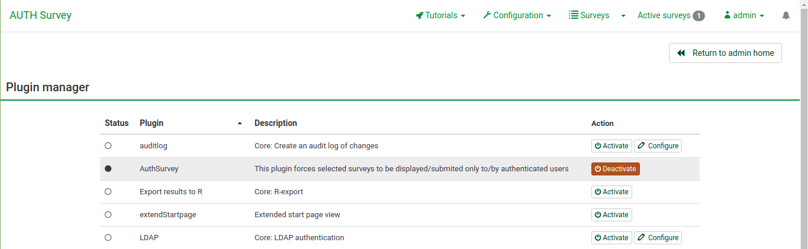

5. Update the required user permissions. The plugin needs permission to save plugin settings. Go to:

   `Configuration > Users > User roles > Select a user or role > Edit permissions`

   Then enable:

   ```text
   Allow user to save plugin settings
   ```
   ```

### Enable AuthSurvey for a specific survey

AuthSurvey is configured per survey. To enable it for one survey:

1. Go to:

   `Surveys > Select desired survey > Simple plugins`

   Alternatively, open the survey plugin settings directly:

   ```text
   ${BASE_URL}/index.php/admin/survey/sa/rendersidemenulink/surveyid/{survey_id}/subaction/plugins
   ```

2. Open the **Settings for plugin AuthSurvey** accordion.
3. Enable the plugin by checking the **Enabled** checkbox.

   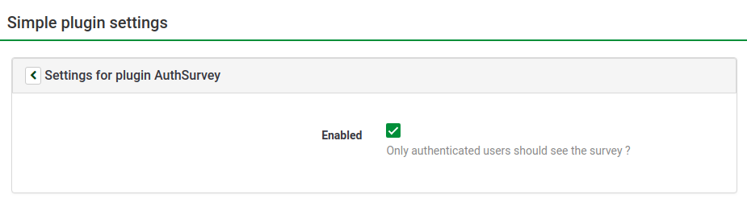

### Interact with AuthSurvey

After AuthSurvey is enabled for a survey, the survey can only be viewed and submitted by authenticated users according to that survey's plugin configuration.

The survey-specific settings are managed from the survey plugin settings page:

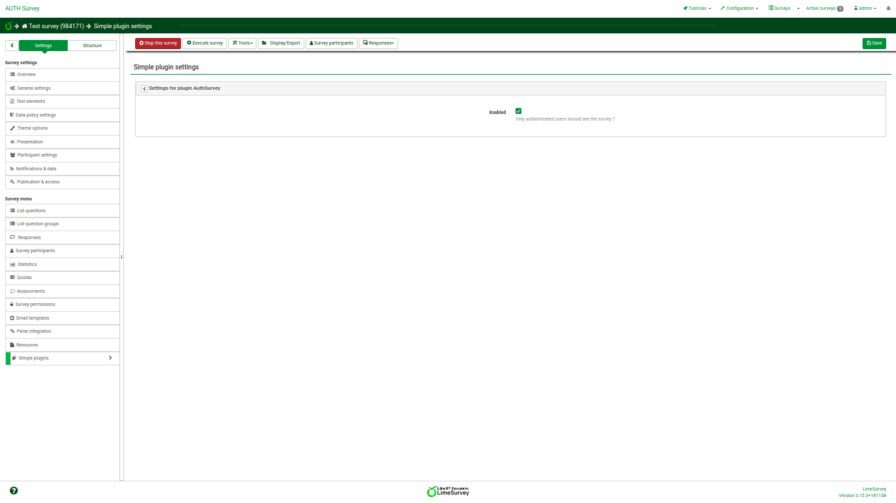

When an unauthenticated or unauthorized user tries to open or submit a protected survey, LimeSurvey displays an unauthorized access error instead of the survey:

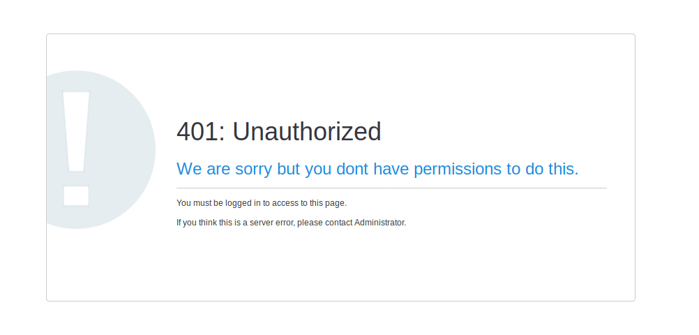

---
## Set permissions for a single survey

These permissions only apply for a single survey. If you want to set permissions for the whole system, you can use global permissions. These permissions can be offered either to a single user or to a user group.

To change the survey permissions, click the Settings tab. Then, click Survey permissions and choose to whom would you like to offer permissions. The permissions can be offered either separately to specific users or to a user group.

 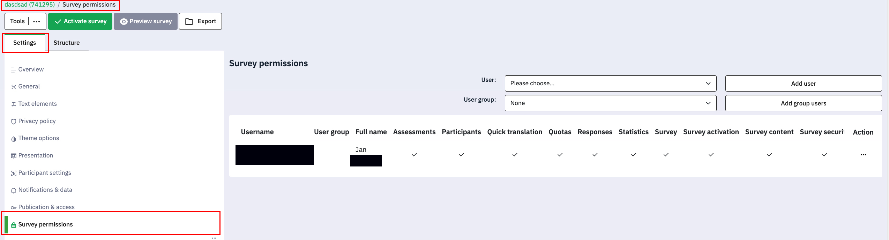

By default, an user (non-admin) cannot grant survey permissions to users that are not part of the same group as the survey administrator. This is a security option enabled by default in Limesurvey. To change this, you need to deactivate option Group member can only see own group, located in the Global settings, under the Security tab. However, if you feel unsure about disabling this option, you can create groups containing those users that can be seen and be granted survey permissions by a survey creator.

Check the following link for further information:
https://manual.limesurvey.org/Manage_users#Set_permissions_for_a_single_survey

---

## Answering a questionnaire

To answer a questionnaire, a user needs an access token and the url of the survey. They can then
answer the survey and the answers are stored in the limesurvey database.

---

## Additional information 

Limesurvey allows custom scripts for a theme. With this feature, custom functionality can be
added, when a user submits an answer, for example. This could be useful in the future.

---

## Tagging and Deployment Strategy

To ensure safe and predictable deployments, this repository uses a semantic versioning tagging strategy.

### Tag Format
Tags must follow the format: `v<Major>.<Minor>.<Patch>` (e.g., `v1.0.1`).

### CI/CD Triggers
The Docker build and publish workflow is triggered on:
- **Push to branches:** `main`, `develop`
- **Push of tags:** `v*.*.*`
- **Pull requests**

### Docker Image Tags
When a Git tag is pushed, the following Docker tags are automatically generated:
- `v<Major>.<Minor>.<Patch>`
- `v<Major>.<Minor>`
- `v<Major>`
- `latest` (only on default branch)

---

## Incompatibilities After the Limesurvey 6 Update and How to Resolve Them
After updating to Limesurvey 6, surveys originally created in Limesurvey 5 may not be fully compatible with the new version. In such cases, errors can occur when accessing or completing these surveys.

The following errors in the user interface, when answering a survey, are related to this issue:

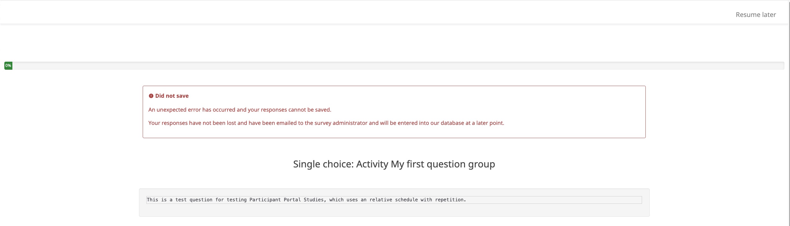

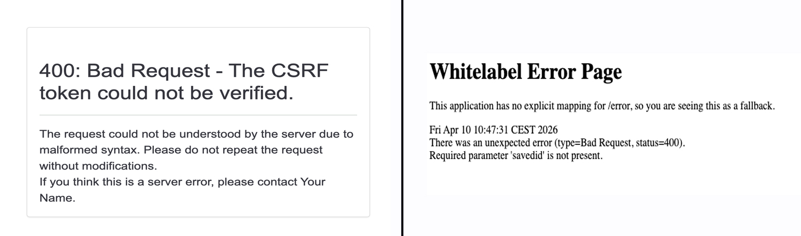


### Resolution
To resolve this issue, the following approach can be used:
- The MORE Studymanager Limesurvey Observation was extended to allow linking a new Limesurvey ID even if the survey already started..
- Existing surveys that were created in Limesurvey 5 and have those issues can be easily exported (.lss or .lsa) and reimported inside the MORE Limesurvey Server. During the import process, Limesurvey 6 automatically adjusts and cleans the survey schema to ensure compatibility.
- After linking the newly imported survey to the corresponding Limesurvey observation, functionality is restored and the survey behaves as expected.

#### Step by Step Guide
1. Go to the MORE Limesurvey server and locate your survey using the linked ID. Open the survey you want to fix and click on the **Export** button.

   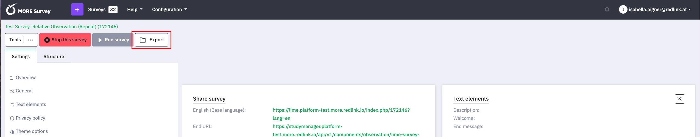

3. Choose either the **.lss** or **.lsa** format for export.

   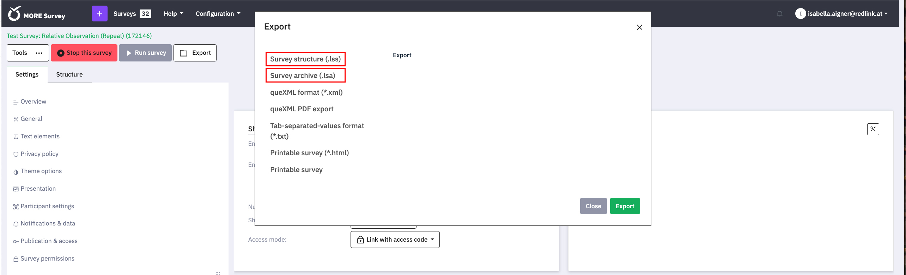

4. Import the survey again into Limesurvey 6. During this process, potential incompatibilities are automatically resolved..

   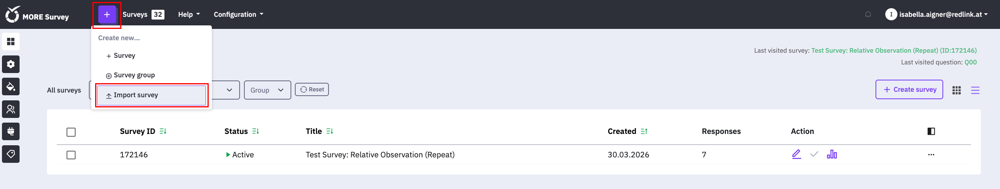


5. Copy the new survey ID and navigate to the MORE StudyManager to relink the new survey within the existing Limesurvey observation.

   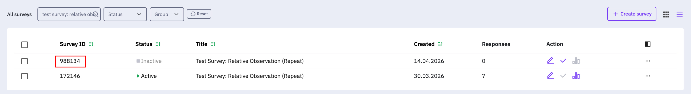<br>
   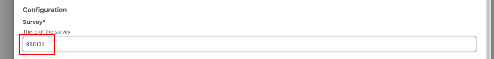

---