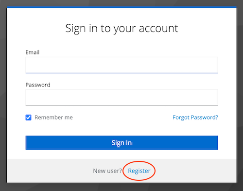

# User Workflow Documentation – Keycloak User Management

## 1. Introduction

### Purpose

This document defines how user data is provided to Redlink for user management in the P2R context.

It ensures a clear understanding between LBI and Redlink regarding:

- Required user information
- Responsibilities of each party
- Secure and compliant handling of personal data

### Scope

This document covers the exchange of user-related data between LBI and Redlink, including:

It includes:

- Responsibilities for providing and processing user data
- Required user attributes for account management
- Definition of user roles and access requirements
- The process for securely transmitting user data

It does not describe internal implementation details within Redlink systems.

--- 

## 2. Operational roles and responsibilities (High level)

For each deployed system (e.g., study environment), a defined set of roles is required to ensure proper user and access
management.

The following roles are established:

### System Administrator

- Responsible for configuring and managing user roles within the system
- Can assign and adjust roles for other users
- Acts as the main authority for access control within the system

### User Management Contact

- Responsible for maintaining the shared user-role tracking list
- Coordinates user access requests and updates
- Communicates changes to System Administrator
- This role may be fulfilled by the Study Administrator

### System Users (Researcher / Viewers)

- Standard users of the system
- Have access to studies based on assigned permissions
- Do not manage roles or user configurations

---

## 3. P2R context: Responsibilities

In the P2R context, responsibilities are assigned as follows:

### P2R User Manager (User Management and System Users)

- Informs users about the self-register process
- Assigns system roles to registered users or provides accurate user information list via email (see section 4)
- Communicates updates and changes in a timely manner
- Request user management reports

Assigned contact: **Gunnar Treff (Study PI)**

### Redlink (Study Administrator)

- Acts as System Administrator in the P2R context
- Ensures secure and correct implementation of roles and permissions
- Can create, update, or deactivate users on request by the P2R User Manager
- Can assign roles according to requests by the P2R User Manager
- Creates User Management Reports on request by the P2R User Manager

Assigned contact: **Jan Cortiel (jan.cortiel@redlink.at)**

---

## 4. P2R: User flow

### 4.1 OAuth Roles and Groups

Keycloak (OAuth) is used for authentication and role assignment. The following groups are defined:

| Group              | Realm Roles       | Description                                                                                                                               |
|--------------------|-------------------|-------------------------------------------------------------------------------------------------------------------------------------------|
| MORE Administrator | incl. MORE Admin  | (System Administrator, Platform Administrator): Rights to manage users, emergency functions, no rights to see data or manipulate studies. |
| MORE Researcher    | incl. MORE Viewer | Can create new studies and access existing studies (based on assigned study-level roles)                                                  |

**Default role:** All newly created users are assigned MORE Researcher unless explicitly specified otherwise.

**Note:** The above Roles are system wide and different to the study roles (Study Administrator, Study Operator, Study
Viewer). The system wide role MORE Researcher can be assigned to any study role. This assignment is done by the study
configuration.

---

### 4.2 User Provisioning Options

#### 1. Self-registration

Users can self register via the <register> link on the Login Page

#### 2. Providing a list of users

After Registration the system roles need to be assigned to the user. Without those roles he is not permitted to access
the different applications of the study environment.

**Option 1**

P2R self-manages role assignment for users. Redlink will provide a special admin user for Keycloak that is allowed to
assign Roles for Users

**Option 2**

- P2R (**Gunnar Treff (Study PI)**) notifies Redlink about users
- Redlink will assign System Roles to the users

*Option 1* is preferable as this removes several process steps and should allow for faster round trip times.
Option 1 requires that P2R personal with this right, know how to assign roles in Keycloak.

---

### 4.3 Required information for role assignment

The following information must be provided in the user list. The list is sent via email to Redlink for processing.

| Field                     | Description                                | Required |
|---------------------------|--------------------------------------------|----------|
| E-mail                    | Email address of the user                  | Yes      |
| System Role(s) / Group(s) | Role(s) assigned to the user               | No       |
| Action type               | Type of change (new / update / deactivate) | Yes      |

**Clarification**

- If no role is provided, MORE Researcher is assigned by default.
- Only **E-mail + Role(s)** are technically required for role assignment in the system
- **Action type** is used to ensure efficient processing of requests in the shared list

### 4.4 User Management Tasks

On request Redlink can provide reports on users and roles. This reports can be requested by the P2R User Manager

